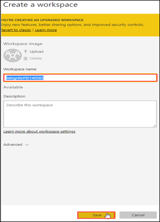
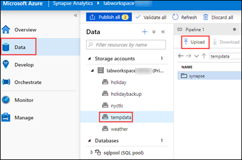
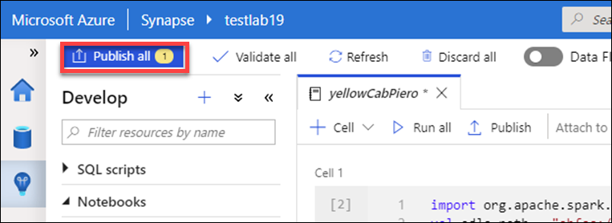
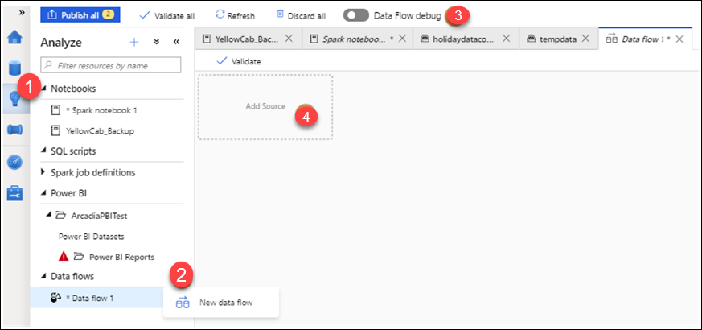
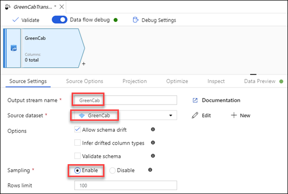
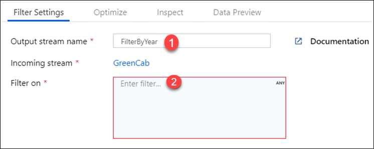
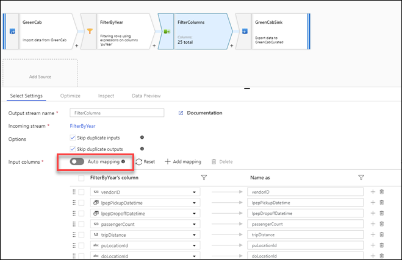
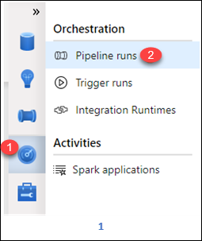
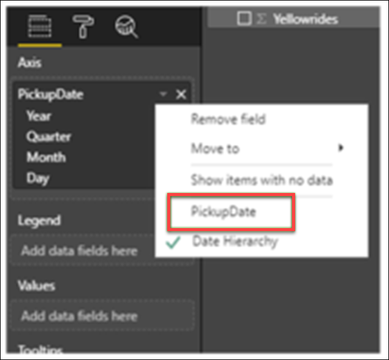

#  Building an end to end analytics pipeline in Microsoft Azure hands-on lab step-by-step

## Abstract and learning objectives

Driving Company provides payment processing services for businesses. It is designing and
implementing a Proof of Concept (PoC) for a unified data analytics platform. Their soft goals is to
bring siloed teams to work together on a single platform.

In this lab, you will play the role of various persona: a data engineer, a business analyst and a data
scientist. The workspace is already setup so you can focus on some of the core development
capabilities of Azure Synapse Analytics.

By the end of this workshop, you will have performed a non-exhaustive list of operations that
combine the strength of Big Data and SQL analytics into a single platform.

To show the breadth and flexibility of tasks you can accomplish on Arcadia, we have two sections to
achieve: Core + Elective. We do expect you to finish the core but hope you can accomplish at least
one elective of your choice.

## Exercise 1: Create the Linked services in the Synapse Workspace

   - Before moving ahead, Verify that **SQL Pool and Spark Pool** are created.

     

### Task 1: Create the ADLS Gen2 linked service

1. Navigate to the Synapse Workspace and click on **Launch Synapse Studio**.

   

2. Create **ADLS Gen 2** linked service by clicking on **Manage** on the Left Pane and then clicking on **+New** 

   

3. Select the **Azure Data Lake Storage Gen2** and click on **continue**.
 
   

4. Provide the following details :

   - Name : **CoreDataLakeStorageBackup**
   
   - Select the subscription where the ADLS storage account is deployed
   
   - Select the ADLS Storage account
   - Test the connection and then click on **create**

   

### Task 2: Create the Azure Synapse Analytics linked service
	
 1. Click on **+New** & select **Azure Synapse Analytics** for creating Synapse Analytics linked service and click on **continue**.
 
    

 2. Provide the following details:
    - Name : **CoreSQLPoolBackup**
    - Select Enter manually 
    - Fully qualified domain name: labworkspaceXXXXXX.database.windows.net
    - Database name: sqlpool
    - Authentication type: SQL authentication
    - User name: sqladmin
    - Password: IgniteRocks!!7112019
    - Test the connection and click on **create**

    

### Task 3: Create the Azure Open Dataset linked service

1. Again, Click on +New and select **Azure Blob Storage** for creating Azure Open dataset Linked service.

   

2. Provide the following details
    - Name : **Azure OpenDataset**
    - Authentication Method : SAS URI
    - SAS URL : https://azureopendatastorage.blob.core.windows.net/
    - SAS Token :“”
    - Test the connection and click on **create**
    
   
  
### Task 4: Create the Power BI linked service

   Inorder to create Power BI linked service firstly we need to create a PowerBI workspace.

1. Create a Power BI workspace
   - Login to http://app.powerbi.com/  using your AAD account.
   - Navigate to Workspaces -> Create a workspace
   
   

   - Create a PowerBI workspace and name it **labignitePBIxxxxxx**
   - Click on **Save**
   
   
     
2. Now create a PowerBI linked service

   - Click on **+New** under the Manage Section->Linked services and select **Power BI** for creating Power BI linked service.
       
   
   
 3. Provide the following details
 
     - Name : **labignitePBI**
     - Select your PBI workspace which you created in the previous step
     - Click on **create**
  
    
    
    
## Exercise 2: Import all the artifacts and set the credentials for SQL Pool and SQL OD in the Synapse Workspace

### Task 1: Import all the SQL scripts and notebooks

1. Import all the **SQL scripts**, Navigate to **Develop** and +Icon then Click on **Import**.

   
   
2. Browse to the folder where the lab files are downloaded.
   - Select the **labfiles** folder then Click on **SQL scripts** folder and select all the SQL scripts to import.
   
3. Import all the **notebooks**.Navigate to **Develop** and +Icon then Click on Import 

   
   
4. Browse to the folder where the lab files are downloaded.
   - Select the **labfiles** folder then Click on **Notebooks** folder and select all the notebooks to import.
   
5. Once you finish importing all the SQL scripts and the notebooks, Click on **publish all** .
   
   
   
### Task 2: Set the credentials for SQL Pool

1. Execute the SQL script **SQLPoolcredentials SETUP ONLY**.
     
    - **SQLPoolcredentials SETUP ONLY** is the SQL script which you imported in task 1.
    - **SQLPoolcredentials SETUP ONLY** SQL script is to assign the role of Database owner to the user.
    - Make sure you **replace the username** with the username you are using for the lab and **connect to sqlpool** not sql on-demand.
    - Click on **Run** and the output should show as command executed successfully.
    - And **publish** the changes.
    
    
    
    
### Task 3: Set the credentials for SQL on-demand
   
1. Execute the SQL script **SQLODStorageCredentials SETUP ONLY**
    
    - **SQLODStorageCredentials SETUP ONLY** is the SQL script which you imported in task 1.
    - Make sure you **replace the Storage account name** that you are using in the lab and **connect to sql on-demand** not sql pool.
    - Click on **Run** and the output should show as command executed successfully.
    - And **publish** the changes.
    
    
  

2. Execute the SQL script **SQLODCredentials SETUP ONLY**   

    - **SQLODCredentials SETUP ONLY** is the SQL script which you imported in the task 1.
    - Make sure you **replace the username** with the username you are using for the lab and **connect to sql on-demand** not sql pool.
    - Click on **Run** and the output should show as command executed successfully.
    - And **publish** the changes.
 
    

## Exercise 3: Create Schemas, Tables, Stored Procedures and Datasets for SQL Pool.

### Task 1: Create Schemas in SQL Pool.

1. Create **Staging** schema

    - Navigate to **Data**-> Databases ->**SQL Pool**->**Schemas**->**New SQL Script**->**New Schema**
    - **Run** **CREATE SCHEMA [Staging]** command.
  
    
  
2. Create **Backup** Schema

    - Navigate to **Data**-> Databases ->**SQL Pool**->**Schemas**->**New SQL Script**->**New Schema**
    - **Run**  **CREATE SCHEMA [Backup]** command
    - **Publish** the changes made after creating both the schemas.
   
   
### Task 2: Create Tables in SQL Pool.
 
 1. Execute the SQL script **CreateStagingBackupTables SETUP ONLY** which you imported in Exercise 2.Make sure you are connected to **sqlpool**
 
 2. Click on **Run** and then **Publish**.
 
 3. Make sure 5 tables are created.
 
    

 
### Task 3: Create Stored Procedures in SQL Pool.
 
1. Execute the SQL script **CreateStoredProcedures SETUP ONLY** which you imported in Exercise 2.Make sure you are connected to **sqlpool**

2. Click on **Run and then Publish**.

3. Make sure 7 stored procedures are created

   

### Task 4: Create Datasets for the pipeline.

1. Navigate to Data->Datasets-> **New Dataset**

   

2. Creation of **FHV Dataset**.

   - Search for **ADLS Data Lake Storage Gen 2** and Click on **Continue**.

   

   - Select **Parquet** as format of data and click continue.

   
 
   - Under Set Properties provide the name as **FHV**
   
   - Select the previously created Linked Service **CoreDataLakeStorageBackup**
   
   - Browse to the File Path nyctlc/fhv
   
   - Click on **OK**.The first dataset is now created.

   

2. Similarly create another 16 datasets by following the below list.

   

   Make sure 17 datasets are created.

## Exercise 4: Create Pipeline and PowerBI dataset.

### Task 1: Create the pipeline.

1. Create Pipeline **EXE2CopyDatatoSQL** by clicking on **Orchestrate**, then + Icon and click on Pipeline.

   
  
2. Name the Pipeline **Exe2CopyDatatoSQL**

   
   
3. Now click on **Code** on the right corner of the page and paste the code provided and click on **OK**.

   
   
4. Paste the code from **EXE2CopyDatatoSQL.json** and click on **Validate** to check if there any errors.

### Task 2: Curate the  Yellow, Green Cab and FHV

1. Navigate to **Develop**->**Notebooks**

2. FHV SETUP ONLY,YellowCab SETUP ONLY and GreenCab SETUP ONLY are the notebooks which you imported in Exercise 2.

3. Run the Notebook **FHV SETUP ONLY**

4. Run the Notebook **YellowCab SETUP ONLY**

5. Run the Notebook **GreenCab SETUP ONLY**

### Task 3: Create the PowerBI dataset.

1. Upload **Marketsharepbiview_PBI.csv** into the **Tempdata** folder by clicking on **Data** on the Left Pane, then Select tempdata      container and then click on **Upload**.

   

2. Browse for **Marketsharepbiview_PBI.csv** and then click on **Done**.

   

3. Click on **Develop** on the left Pane and then import the Notebook **PBIReadViewDataIntoSQLPool**

   

4. Click on **Configure session** on the Right side of the page.

   

5. Configure the session as follows:

   

6. Open the notebook **PBIReadViewDataIntoSQLPool** and Update the ADLS account in Cell 1 and Cell 3 and Click on **Run All**.

   

7. Navigate to **Develop** on the left pane and click on **Power BI datasets** under the **Power BI Linked service**. Then Click on **+ New Power BI dataset.**

   

8. Click on **Start** on the page that comes up.

   

9. Click on **sqlpool** and then click on Continue.

   

10. Now click on **Download**

    

11. Open the downloaded file in the Power BI desktop and Log into the Power BI Desktop using Microsoft Account and **sign-in**. Then click on **Connect**

    

12. Click on **Marketsharepbiview_PBI** (previously created in the step1) and then click on **Load Data**.  

    

13. Publish your Desktop PBI to the Power BI workspace that you linked to your Synapse workspace.

    

14. Make sure you publish on the PBI Workspace created by you.Click on **Select**.

    

15. Go back to the Synapse Workspace and then click on Finish and refresh

    

   
## Exercise 5: Explore the lake with SQL On-Demand and Spark

This section will highlight how you can explore data using the engine of your choice.
   
### Task 1: Explore the lake with SQL On-Demand
   
   In this task, you will browse your data lake. 
   
1. Go into the **YellowCab** folder, **select the year and month** folders of your choice, then **select a file**, right click and select **New SQL script**. A script is automatically generated. 

2. **Run** this script to see how SQL on demand queries the file and returns the first 100 rows of that file with the header allowing you to easily explore data in the file.

### Task 2: Explore the lake and create a table with Spark

1. Similarly, now go to the folder **holidaybackup/processed**. 

2. Select the file **part-00000-tid5126373485025311044-8121f1d6-4c9d-4e4c-8e78-fbe2733fc3a5-649-c000.snappy.parquet** and **New
Notebook**. This will generate a notebook with PySpark code to load the data in a dataframe and display10 rows with the header. 

3. Attach the notebook to a **Spark pool** and Click on **run** to execute the command.

## Exercise 6: Build Modern Data Warehouse pipelines

- This section is very important to create a pipeline with parallel activities to bring data into the lake,transform it and load it into the SQL Pool.

### Task 1: Create and run a Notebook for YellowCab

- In this notebook you will see the power of the AAD passthrough between compute and storage whether
it’s a data lake or a database. You will see how simple it is to write into a SQL Pool table with Spark thanks
to the connector. No need to create password, identity, external table, format sources. It’s all managed
by the connector!

1. Go into the **Develop** section

2. Select the notebook section and click on the notebook **EXE2 YellowCab**

3. Configure and author your notebook:
- Attach your **Spark Compute**
- Select **Spark** as a language
- Define the configuration of the session. Defining the configuration of a session enables you to increase the resources of running a   notebook. Use **4 executors** of medium size for that notebook. You want to run it fast!

4. Click on **Publish**

5.Click on **Run All**

### Task 2: Create and run a Dataflow with GreenCab dataset

- In this task, we will be doing a similar as in task 1 but in a code-free environment on the green cab data.
You will also learn the important concept of dataset by creating a new dataset.

1. Click on **Develop**

2. In Data Flow, create a **New data flow**

3. Name the Data Flow activity **GreenCabTransformation**

4. Click on Data Flow Debug, select **AutoResolveIntegrationRuntime** and click **Ok**

5. Click on **Add Source**

6. Select the dataset **GreenCab**

7. Call the output stream name **GreenCab**

8. Select **Enable** sampling

9. In the Source Options:

  - Partition root path: **green**

10. On Source Settings Edit the **GreenCab** Dataset 

11. **Import schema** From connection/store

12. Click on + next to the GreenCab activity

13. Select the **row modifier** filter

14. Enter the following for **Output stream name: FilterByYear**

15. Click on **Filter on**

16. Write the following in the box: in(['2015', '2016', '2017', '2018'],puYear)

17. Click on **Save and Finish**

18. Click on + next to the Filter activity

19. Select the **Select** Activity

20. Enter the following for **Output stream name: FilterColumns**

21. Click on **Filter on**

22. **Select Automapping**

23. Remove the columns: vendorID, lpepPickupDateTime, lpepDropoffDateTime, tripDistance,rateCodeId, storeAndFwdFlag, paymentType, fareAmount, extra, mtaTax,improvementSurcharge, tollsAmount, ehailFee, tripType.

24. Click on + next to the Filter activity

25. Select the **Sink** destination

26. Call the output stream name **GreenCabSink**

27. Select +New as dataset, Select +ADLSg2 as a storage layer

28. Select **Parquet**

29. Name it as **DataflowSink**

30. Select the linked service **CoreDataLakeStorageBackup**

31. For the File system in the file path, write **tempdata**

32. Click on **Finish**

33. If you preview the data of GreenCabSink, you should see the following:

34. Turn of the **Debug Session** and click on **Publish all**

35. Try to run the data flow in a pipeline by following the flow below (you will monitor that
pipeline later on in task 5)

 - Click on **Orchestrate**

 - Add a new pipeline by clicking **+**

 - Drag and drop a data flow activity in the pipeline. Make sure that you select **GreenCabTransformation**.

 - **Publish** the pipeline

 - Click on Add and trigger and select **Trigger Now** (Do not wait for the result to finish (it will take 7 minutes – you will see the result in task 5))

### Task 3: Create Stored Procedures

- In this section, we will create stored procedures in the SQL Pool that will be triggered in the pipeline once
the curated data is loaded in the SQL Pool.

1. Open the SQL script in the **Develop section** called **EXE 2 StoredProceduresCabs**. This script will create four stored procedures that you will later integrate in your pipeline once the loadoperation in the SQL Pool happens.
 
2. Click on **Run** and it will run the entire SQL script

3. Check that you can see the four stored procedures by browsing your SQL Pool:

### Task 4: Understand a pipeline that contains all activities

- This pipeline had been run before the lab. This pipeline copied curated data from the lake into a SQL Pool
as staging table. A staging table is a table optimized for loading/writing data. Once the copy activity was
complete, it triggered a stored procedure that transformed the staging table into a destination table
whose goal is to provide strong read performance. Exercise 4 will highlight the speed of reading data!

1. Click into the **Orchestrate** section

2. Select the pipeline **EXE2CopyDatatoSQL** in the Pipelines

3. Check the various activities run in the pipeline

### Task 5: Monitor the pipeline

- Synapse will offer a single pane of glass to monitor activities. We will first look at the pipeline that you
have triggered.

1. Click at the section **Monitoring**

2. Click into **Pipeline runs**, make sure that the time of filtering is set to Last 30 days

3. Check the status of your pipeline. It should be in-progress

4. To understand at a more granular level, the status of the activities in the pipeline, click on the
pipeline

5. You can get the detail of an activity by clicking to the binocular icon. In this case, you can see the performance of a copy command activity. Check the various details based on the different
activities you ran. (Data Flow, notebook, SQL Script)

### Task 6: Monitor Spark applications

- A Spark application consists of many activities that have run into a single session. A session is displayed as in-progress, failed or cancelled. When a user is done with her job, the application session ends as cancelled. It is by no mean a negative impact.

1. Click at the section Monitoring

2. Click into Spark Applications

3. You can see the application name (and click into it for more details), see who submitted this job,
the time, the stats, which pool template was leveraged and the job type.

4. Click into one application and check the picture below highlighting some of the monitoring functionalities

## Exercise 7: Power BI Integration

In this exercise you will be able to create a Power BI Report and build a visualization within Synapse Analytics leveraging previously created datasets.

### Task 1: Create a Power BI Report

1. Click on the Power BI Report within the synapse workpsace.

  - Navigate to Develop->Power BI->PowerBI report and select the PowerBI report.
  
2. The Power BI Report Builder will appear, You can now build your report based on the Imported SQL Dataset.

3. Select from the Visualization the Line Chart and drag and drop the **PickupDate** into the Axis and the other fields into the Values and then adjust the report:

4. You will now get your report

5. You can Save the Report to the Workspace, You can view the report in both Synapse Analytics and PowerBI

## Exercise 8: High Performance Analysis with SQL Analytics Pool

### Task 1: SQL Pool query to understand market shares between cab companies

1. This query will be a simple exercise to understand the evolution of over the time of the amounts of daily
rides that the yellow cabs, green cabs and for hire vehicle (includes companies like Uber and Lyft) served
in New York.

2. **Example**:You can run a query that will aggregate the count of rides per day for each view and join these three views together per day. Display the results in a chart similar to below:

![example(images/75.png)

 - Select the SQL Script called Query Market Share and run the script against the SQL Pool database.
 - Select Chart
 - From the Y axis columns unselect PickupDate
 - Select PickupDate for the X-Axis column

### Task 2: Monitor the queries through the DMV

- Monitoring the queries that run in SQL Analytics Pool is very simple. You can look at the queries that have run in your SQL Pool.

1. Select **Monitor queries** SQL Script in the Analyze section.

2. **Run** the script against the SQL Pool database.

## Exercise 9: Create views with SQL Analytics On-Demand 

- In this section, we will look at the same query you ran in a SQL Pool (Exercise 4) but over the Data Lake. If you have not done exercise 8, then this simple exercise is to understand the evolution of over the time of the amounts of daily rides that yellow cabs, green cabs and for hire vehicles (includes companies like Uber and Lyft) served in New York. Performance to query the lake will not be as strong as the query performance in a SQL Pool but SQL Analytics On-Demand is a powerful and flexible capability for data exploration and low cost BI with infrequent access to the lake. No data movement is required.

### Task 1: Create three views over the data lake.
 
1. Select the SQL Script called **Create SQL OD Views** from the Analyze section.
2. Make sure that script is connect to the SQL on-demand and the master database
3. Run the script
4. Check that the three views are available (refresh if needed the SQL Analytics On-Demand).

5. **Example**: Run a query that will aggregate the count of rides per day for each view and join these three views together per day .Try to display the results in a chart similar to below:

 - Run the following SQL Script against SQL On-Demand and the database (not master):
  
  Select PickupDateYellow,FHVrides,Yellowrides, Greenrides from
  dbo.YellowCabAggregated
  INNER JOIN dbo.FHVAggregated ON dbo.FHVAggregated.PickupDateFHV =
  dbo.YellowCabAggregated.PickupDateYellow
  INNER JOIN dbo.GreenCabAggregated ON
  dbo.GreenCabAggregated.PickupDateGreen = dbo.YellowCabAggregated.PickupDateYellow
  ORDER BY PickupDateFHV ASC 
  
6. Select Chart
7. From the Y axis columns unselect PickupDateYellow
8. Select PickupDateYellow for the X-Axis column

## Exercise 10: Data Science with Spark

- In this exercise you will play the role of a Data Scientist that based on the NYC Yellow Cab Dataset (that tracks trips and various attributes) using Synapse Notebook creates a model to predict for a given trip whether there will be a tip or not.

Create a new Notebook (for details check Exercise 7).
1. Configure and author your notebook:
a. Attach your Spark Compute
b. Select Spark as a language: **Pyspark**
c. Click on **Add text** or **{} Add code** for each cell below:

For text cell:

For code cell:

Cell 1 – **Text cell**

## Notebook :Predict NYC Taxi Tips using Spark ML and Azure Open Datasets

- The notebook ingests, visualizes, prepares and then trains a model based on an Open Dataset that tracks NYC Yellow Taxi trips and various attributes around them.

- The goal is to predict for a given trip whether there will be a tip or not.

- The Notebook **EXE6 Data Science Final_PySpark** is uploaded for you in the **Develop** section and rich text is provided to explain every single step. Note that you will need to replace the ADLS G2 Storage account **YourADLSAccount** with your Account name.

- Here’s a summary of the steps you will be performing:

1. **Ingest Data**

Get the data from the Open Datasets store and then down sample using filtering and sampling to generate a smaller set of data to make it faster/easier to evaluate different approaches to prep for the modelling phase later in the notebook.

2. **Exploratory Data Analysis**
Look at the data and evaluate its suitability for use in a model, do this via some basic charts focused on tip values and relationships.

3.**Data Prep and Featurization**

It's clear from the visualizations above that there are a bunch of outliers in the data. These will need to be filtered out in addition there are extra variables that are not going to be useful in the model we build at the end.

Finally there is a need to create some new (derived) variables that will work better with the model.

4.**Data Prep and Featurization Part 2**

Having created new variables its now possible to drop the columns they were derived from so that the dataframe that goes into the model is the smallest in terms of number of variables, that is required.
Also create some more features based on new columns from the first round.

5.**Encoding**

Different ML alogirthms support different type sof input, for this example Logistic Regression is being used for Binry Classification. This means that any Categorical (string) variables must be converted to numbers.

The process is not as simple as a "map" style function as the relationship between the numbers can introduce a bias in the resulting model, the approach is to index the variable and then encode using a standard approach called One Hot Encoding.

This approach requires the encoder to "learn"/fit a model over the data in the Spark instance and then transform based on what was learnt.

6.**Generation of Testing and Training Data Sets**
Simple split, 70% for training and 30% for testing the model. Playing with this ratio may result in different models.

7.**Train the Model**
Train the Logistic Regression model and then evaluate it using Area under ROC as the metric.
The ROC is a graphical plot that illustrates the diagnostic ability.
For our Model the “Area under ROC = 0.989821882951654” and this is considered excellent

8.**Evaluate and Visualize**

Plot the actual curve to develop a better understanding of the model.
See the Area under the ROC model:

  

    

