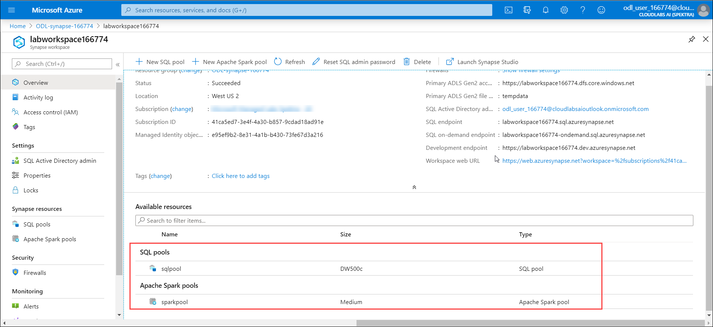
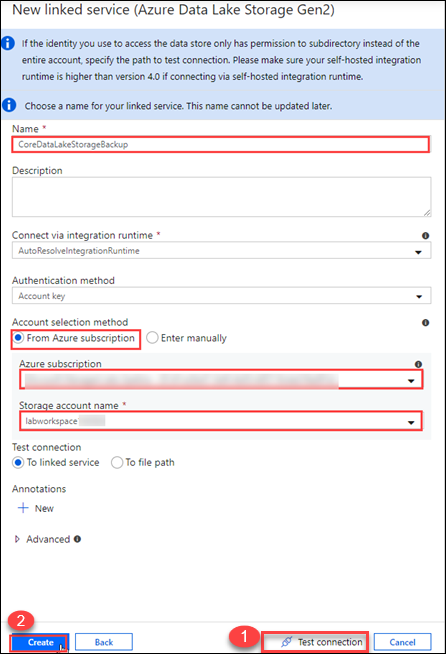
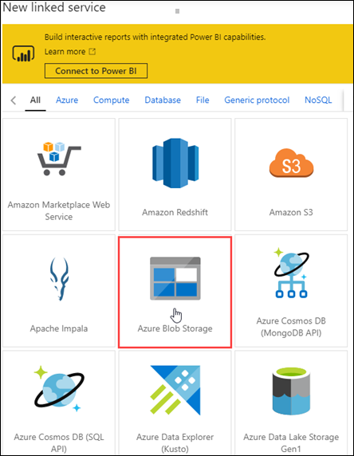
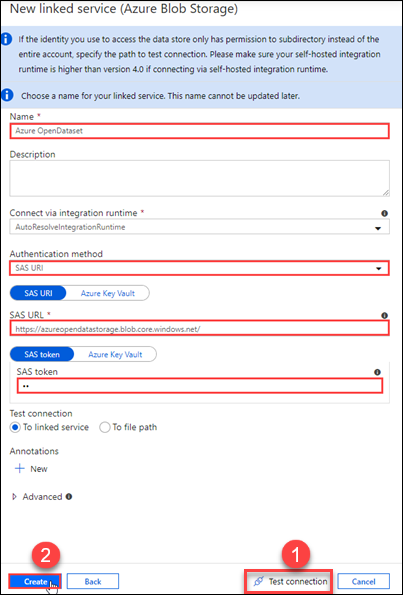
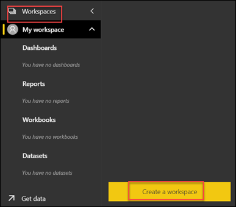
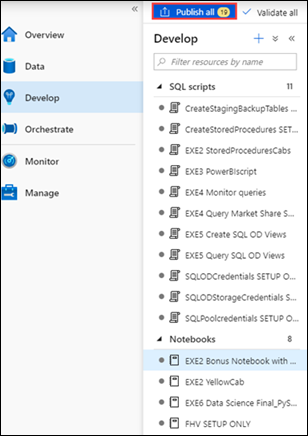
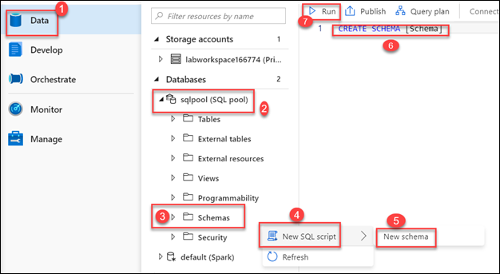
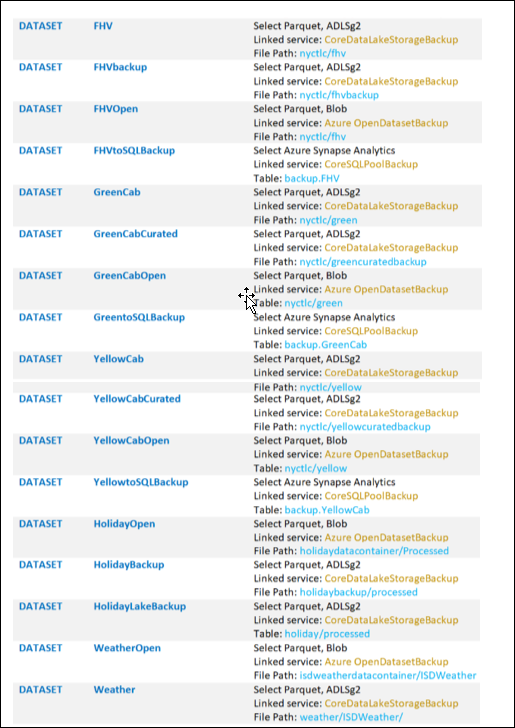
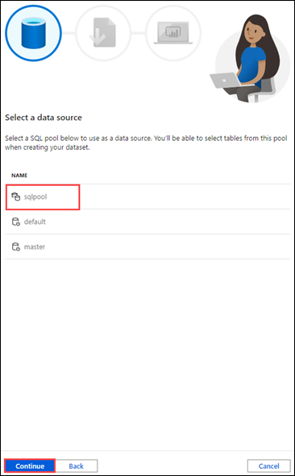

#  Building an end to end analytics pipeline in Microsoft Azure hands-on lab step-by-step

## Abstract and learning objectives

Driving Company provides payment processing services for businesses. It is designing and
implementing a Proof of Concept (PoC) for a unified data analytics platform. Their soft goals is to
bring siloed teams to work together on a single platform.

In this lab, you will play the role of various persona: a data engineer, a business analyst and a data
scientist. The workspace is already setup so you can focus on some of the core development
capabilities of Azure Synapse Analytics.

By the end of this workshop, you will have performed a non-exhaustive list of operations that
combine the strength of Big Data and SQL analytics into a single platform.

To show the breadth and flexibility of tasks you can accomplish on Arcadia, we have two sections to
achieve: Core + Elective. We do expect you to finish the core but hope you can accomplish at least
one elective of your choice.

## Exercise 1: Create the Linked services in the Synapse Workspace

   Before moving ahead, Verify that **SQL Pool and Spark Pool** are created.

   

### Task 1: Create the ADLS Gen2 linked service

1. Navigate to the Synapse Workspace and click on **Launch Synapse Studio**.

   

2. Create **ADLS Gen 2** linked service by clicking on **Manage** on the Left Pane and then clicking on **+New** 

   

3. Select the **Azure Data Lake Storage Gen2** and click on **continue**.
 
   

4. Provide the following details :
   - Name : **CoreDataLakeStorageBackup**
   - Select the subscription where the ADLS storage account is deployed
   - Select the ADLS Storage account
   - Test the connection and then click on **create**

   

### Task 2: Create the Azure Synapse Analytics linked service
	
 1. Click on **+New** & select **Azure Synapse Analytics** for creating Synapse Analytics linked service and click on **continue**.
 
    

 2. Provide the following details:
    - Name : **CoreSQLPoolBackup**
    - Select Enter manually 
    - Fully qualified domain name: labworkspaceXXXXXX.database.windows.net
    - Database name: sqlpool
    - Authentication type: SQL authentication
    - User name: sqladmin
    - Password: IgniteRocks!!7112019
    - Test the connection and click on **create**

    

### Task 3: Create the Azure Open Dataset linked service

1. Again, Click on +New and select **Azure Blob Storage** for creating Azure Open dataset Linked service.

   

2. Provide the following details
    - Name : **Azure OpenDataset**
    - Authentication Method : SAS URI
    - SAS URL : https://azureopendatastorage.blob.core.windows.net/
    - SAS Token :“”
    - Test the connection and click on **create**
    
   
  
### Task 4: Create the Power BI linked service

   Inorder to create Power BI linked service firstly we need to create a PowerBI workspace.

1. Create a Power BI workspace
   - Login to http://app.powerbi.com/  using your AAD account.
   - Navigate to Workspaces -> Create a workspace
   
     

   - Create a PowerBI workspace and name it **labignitePBIxxxxxx**
   - Click on **Save**
   
     
     
2. Now create a PowerBI linked service

   - Click on **+New** under the Manage Section->Linked services and select **Power BI** for creating Power BI linked service.
       
     
   
 3. Provide the following details
     - Name : **labignitePBI**
     - Select your PBI workspace which you created in the previous step
     - Test the connection and click on **create**
  
    
    
    
## Exercise 2: Import all the artifacts and set the credentials for SQL Pool and SQL OD in the Synapse Workspace

### Task 1: Import all the SQL scripts and notebooks

1. Import all the **SQL scripts**

   
   
2. Import all the **notebooks**

   
   
3. Once you finish importing all the SQL scripts and the notebooks, Click on **publish all** .
   
   
   
### Task 2: Set the credentials for SQL Pool

1. Execute the SQL script **SQLPoolcredentials SETUP ONLY**.
     
    - **SQLPoolcredentials SETUP ONLY** is the SQL script which you imported in task 1.
    - **SQLPoolcredentials SETUP ONLY** SQL script is to assign the role of Database owner to the user.
    - Make sure you **replace the username** with the username you are using for the lab and **connect to sqlpool** not sql on-demand.
    - Click on **Run** and the output should show as command executed successfully.
    
    
    
    
### Task 3: Set the credentials for SQL on-demand
   
1. Execute the SQL script **SQLODStorageCredentials SETUP ONLY**
    
    - **SQLODStorageCredentials SETUP ONLY** is the SQL script which you imported in task 1.
    - Make sure you **replace the Storage account name** that you are using in the lab and **connect to sql on-demand** not sql pool.
    - Click on **Run** and the output should show as command executed successfully.
    
    
  

2. Execute the SQL script **SQLODCredentials SETUP ONLY**   

    - **SQLODCredentials SETUP ONLY** is the SQL script which you imported in the task 1.
    - Make sure you **replace the username** with the username you are using for the lab and **connect to sql on-demand** not sql pool.
    - Click on **Run** and the output should show as command executed successfully.
 
    

## Exercise 3: Create Schemas, Tables, Stored Procedures and Datasets for SQL Pool.

### Task 1: Create Schemas in SQL Pool.

1. Create **Staging** schema

    - Navigate to **Data**-> Databases ->**SQL Pool**->**Schemas**->**New SQL Script**->**New Schema**
    - **Run** **CREATE SCHEMA [Staging]** command.
  
   
  
2. Create **Backup** Schema

    - Navigate to **Data**-> Databases ->**SQL Pool**->**Schemas**->**New SQL Script**->**New Schema**
    - **Run**  **CREATE SCHEMA [Backup]** command
    - **Publish** the changes made after creating both the schemas.
   
   
### Task 2: Create Tables in SQL Pool.
 
 1. Execute the SQL script **CreateStagingBackupTables SETUP ONLY** which you imported in Exercise 2.
 
 2. Click on **Run** and then **Publish**.
 
 3. Make sure 5 tables are created.
 
   

 
### Task 3: Create Stored Procedures in SQL Pool.
 
1. Execute the SQL script **CreateStoredProcedures SETUP ONLY** which you imported in Exercise 2.

2. Click on **Run and then Publish**.

3. Make sure 7 stored procedures are created

  

### Task 4: Create Datasets for the pipeline.

1. Navigate to Data->Datasets-> **New Dataset**

  

2. Creation of **FHV Dataset**.

   - Search for **ADLS Data Lake Storage Gen 2** and Click on **Continue**.

  

   - Select **Parquet** as format of data and click continue.

  

   - Under Set Properties provide the name as **FHV**
   
   - Select the previously created Linked Service **CoreDataLakeStorageBackup**
   
   - Browse to the File Path nyctlc/fhv
   
   - Click on **OK**.The first dataset is now created.

  

2. Similarly create another 16 datasets by following the below list.

  

  Make sure 17 datasets are created.

## Exercise 4: Create Pipeline and PowerBI dataset.

### Task 1: Create the pipeline.

1. Create Pipeline **EXE2CopyDatatoSQL** by clicking on **Orchestrate**, then + Icon and click on Pipeline.

  
  
2. Name the Pipeline **Exe2CopyDatatoSQL**

   
   
3. Now click on **Code** on the right corner of the page and paste the code provided and click on **OK**.

   
   
4. Paste the code from **EXE2CopyDatatoSQL.json** and click on **Validate** to check if there any errors.

### Task 2: Curate the  Yellow, Green Cab and FHV

1. Navigate to **Develop**->**Notebooks**

2. FHV SETUP ONLY,YellowCab SETUP ONLY and GreenCab SETUP ONLY are the notebooks which you imported in Exercise 2.

3. Run the Notebook **FHV SETUP ONLY**

4. Run the Notebook **YellowCab SETUP ONLY**

5. Run the Notebook **GreenCab SETUP ONLY**

### Task 3: Create the PowerBI dataset.

1. Upload **Marketsharepbiview_PBI.csv** into the **Tempdata** folder by clicking on **Data** on the Left Pane, then Select tempdata      container and then click on **Upload**.

2. Browse for **Marketsharepbiview_PBI.csv** and then click on **Done**.

3. Click on **Develop** on the left Pane and then import the Notebook **PBIReadViewDataIntoSQLPool**

4. Click on **Configure session** on the Right side of the page.

5. Configure the session as follows:

6. Open the notebook **PBIReadViewDataIntoSQLPool** and Update the ADLS account in Cell 1 and Cell 3 and Click on **Run All**.

7. Navigate to **Develop** on the left pane and click on **Power BI datasets** under the **Power BI Linked service**. Then Click on **+ New Power BI dataset.**

8. Click on **Start** on the page that comes up.

9. Click on **sqlpool** and then click on Continue.

10. Now click on **Download**

11. Open the downloaded file in the Power BI desktop and Log into the Power BI Desktop using Microsoft Account and **sign-in**. Then click on **Connect**

12. Click on **Marketsharepbiview_PBI** (previously created in the step1) and then click on **Load Data**.  

13. Publish your Desktop PBI to the Power BI workspace that you linked to your Synapse workspace.

14. Make sure you publish on the PBI Workspace created by you.Click on **Select**.

15. Go back to the Synapse Workspace and then click on Finish and refresh

   

   
   
   
   
  

    

