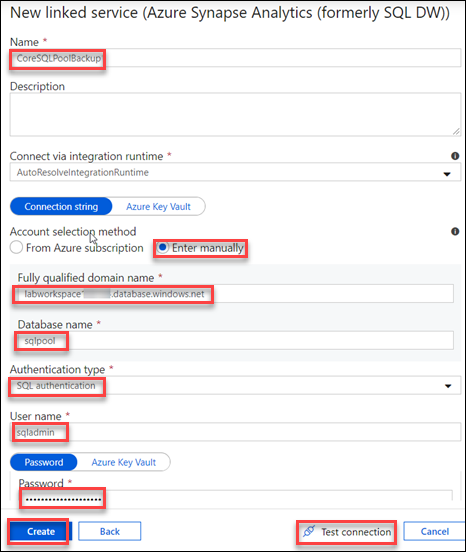
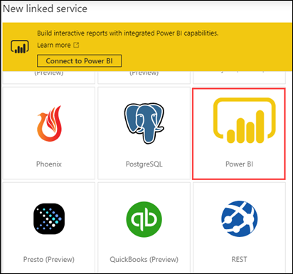

#  Building an end to end analytics pipeline in Microsoft Azure hands-on lab step-by-step

## Abstract and learning objectives

Driving Company provides payment processing services for business. It is designing and implementing a Proof of Concept (PoC) for a unified data analytics platform. Their soft goals is to bring siloed teams to work together on a single platform.

In this lab, you will play the role of various persona: a data engineer, a business analyst and a datascientist. The workspace is awill be setup by you in before the hands on part so you can focus on some of the core development capabilities of Azure Synapse Analytics.

By the end of this workshop, you will have performed a non-exhaustive list of operations that combine the strength of Big Data and SQL analytics into a single platform.

## Exercise 1: Create the Linked services in the Synapse Workspace

Duration: 10 minutes

- Before moving ahead, Verify that **SQL Pool and Spark Pool** are created.

     

### Task 1: Create the ADLS Gen2 linked service

1. Navigate to the Synapse Workspace and click on **Launch Synapse Studio**.

   

2. Create **ADLS Gen 2** linked service by clicking on **Manage** on the Left Pane and then clicking on **+New** 

   

3. Select the **Azure Data Lake Storage Gen2** and click on **continue**.
 
   

4. Provide the following details :

   - Name : **CoreDataLakeStorageBackup**
   
   - Select the subscription where the ADLS storage account is deployed
   
   - Select the ADLS Storage account
   - Test the connection and then click on **create**

   

### Task 2: Create the Azure Synapse Analytics linked service
	
 1. Click on **+New** under the Manage Section->linked Services & select **Azure Synapse Analytics** for creating Synapse Analytics linked service and click on **continue**.
 
    

 2. Provide the following details:
    - Name : **CoreSQLPoolBackup**
    - Select Enter manually 
    - Fully qualified domain name: **labworkspaceXXXXXX.database.windows.net** where xxxxxx is the deployment id. Make sure to replace xxxxxx with the deployment id that is assigned for you to perform the lab.
    - Database name: **sqlpool**
    - Authentication type: SQL authentication
    - User name: **sqladmin**
    - Password: **IgniteRocks!!7112019**
    - Test the connection and click on **create**

    

### Task 3: Create the Azure Open Dataset linked service

1. Again, Click on +New and select **Azure Blob Storage** for creating Azure Open dataset Linked service.

   

2. Provide the following details
    - Name : **Azure OpenDataset**
    - Authentication Method : SAS URI
    - SAS URL : https://azureopendatastorage.blob.core.windows.net/
    - SAS Token :“”
    - Test the connection and click on **create**
    
   
  
### Task 4: Create the Power BI linked service

   Inorder to create Power BI linked service firstly we need to create a PowerBI workspace.

1. Create a Power BI workspace
   - Login to http://app.powerbi.com/  using your credentials from the environment details page.
   - Navigate to Workspaces -> Create a workspace
   
   

   - Create a PowerBI workspace and name it **labignitePBIxxxxxx** where xxxxxx is the deployment id.Make sure to replace xxxxxx with the deployment id that is assigned for you to perform the lab.
   - Click on **Save**
   
   
     
2. Now create a PowerBI linked service

   - Click on **+New** under the Manage Section->Linked services and select **Power BI** for creating Power BI linked service.
       
   
   
 3. Provide the following details
 
     - Name : **labignitePBI**
     - Select your PBI workspace which you created in the previous step
     - Click on **create**
  
    
    
    Click **Next** to go to the next exercise.
