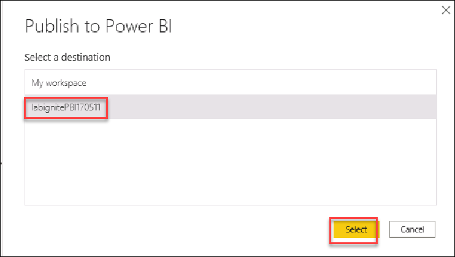
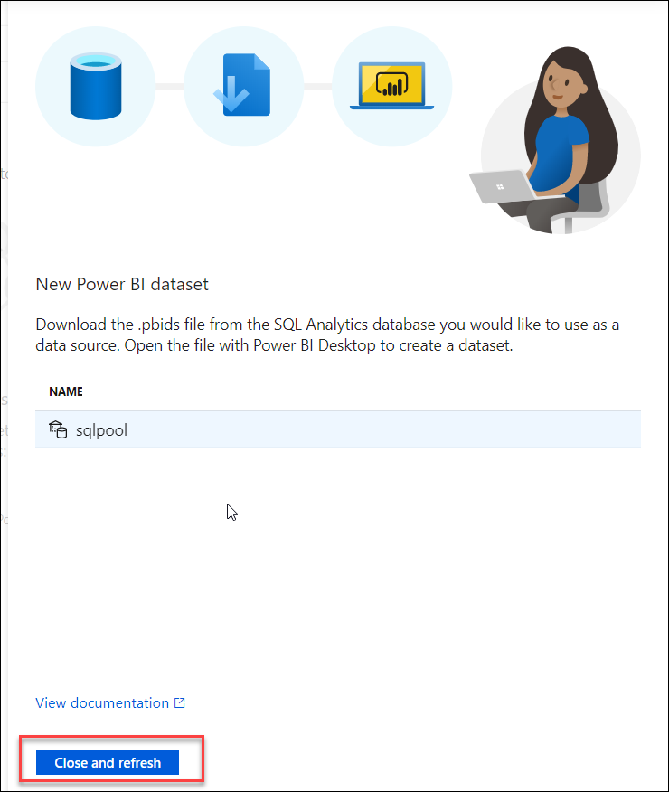

## Exercise 4: Create Pipeline and PowerBI dataset.

Duration: 40 minutes

### Task 1: Create the pipeline.

1. Create Pipeline **EXE4CopyDatatoSQL** by clicking on **Orchestrate**, then + Icon and click on Pipeline.

   
  
2. Name the Pipeline **EXE4CopyDatatoSQL**

   
   
3. Browse to **C:\LabFiles\Building-an-end-to-end-analytics-pipeline-in-Microsoft-Azure-master\labfiles\EXE4CopyDatatoSQL.json**
   Open the file in the notepad and **copy the code** as you will be using it in the next step.
   
4. Now click on **Code** on the right corner of the page and paste the code that you copied in the previous step and click on **OK**. 
   Then click on **Validate** to check if there any errors and **Publish**

   
   
5. Don't run the pipeline now,You will be doing it in the further exercises.
   
### Task 2: Curate the  Yellow, Green Cab and FHV

1. Navigate to **Develop**->**Notebooks**

2. FHV SETUP ONLY,YellowCab SETUP ONLY and GreenCab SETUP ONLY are the notebooks which you imported in Exercise 2.

3. Description of the notebooks
   - **EXE4 FHV SETUP ONLY** notebook copies the data from **fhvbackup** folder to **fhv** 
   - **EXE4 YellowCab SETUP ONLY** copies the data from **yellow** folder to **yellowcuratedbackup**
   - **EXE4 GreenCab SETUP ONLY** copies the data from **green** folder to **greencuratedbackup** 

4. Follow the instructions in the notebook **EXE4 FHV SETUP ONLY** 

  - **Replace the Storage account name along with primary key in cell 1** 
      To get the value of Primary key, navigate to Storage account->Access keys->Copy the value of key 1
  
     

 - **Replace the storage account name in cell 3** and then Click on **Run** to execute the notebook **EXE4 FHV SETUP ONLY**
    
     
 
5. Follow the instructions in the notebook **EXE4 YellowCab SETUP ONLY**
 
  - **Replace the Storage account name along with primary key in cell 1** 
  
     

  - **Replace the storage account name in cell 4** and then Click on **Run** to execute the notebook **EXE4 YellowCab SETUP ONLY**
     
     

6. Follow the instructions in the notebook **EXE4 GreenCab SETUP ONLY**
  
  - **Replace the Storage account name along with primary key in cell 1** 
       
      

  - **Replace the storage account name in cell 3** and then Click on **Run** to execute the notebook **EXE4 GreenCab SETUP ONLY**
   
      
7. **Publish** to save the changes.

### Task 3: Create the PowerBI dataset.

1. Upload **Marketsharepbiview_PBI.csv** into the **tempdata** folder by clicking on **Data** on the Left Pane, then Select **tempdata**    container and then click on **Upload**.

   

2. Browse for **Marketsharepbiview_PBI.csv** ,navigate to **C:\LabFiles\Building-an-end-to-end-analytics-pipeline-in-Microsoft-Azure master\labfiles\Marketsharepbiview_PBI.csv** and Select the file Marketsharepbiview_PBI.csv then select **upload** button followed by **Done**.

   

3. Navigate to **Develop->Notebooks** on the left Pane and then Open the Notebook **EXE4 PBIReadViewDataIntoSQLPool**
   
4. In the notebook **EXE4 PBIReadViewDataIntoSQLPool** ,**Update the ADLS storage account name in Cell 1 and Cell 3** and Click on **Run All** and **Publish** the changes.

   

5. Navigate to **Develop** on the left pane and click on **Power BI datasets** under the **Power BI **. Then Click on **+ New Power BI dataset.**

   

6. Click on **Start** then select **sql pool** and click on **Continue**

   

   
   
7. Download the .pbids file

   

8. Open the downloaded file in the Power BI desktop and Log into the Power BI Desktop using Microsoft Account and **sign-in**. Then click on **Connect**

    

9. Select **Marketsharepbiview_PBI** and then click on **Load Data**. Click on **Ok** if a dialog box of Connection Settings appears.

    

10. Wait until the data loading process is completed ,After the data loading is completed do the following:
    - A dialog box appears to save the report, Save the report as **PBILabxxxxxx** to the VM before publishing the report,where xxxxxx is the unique deployment ID you are using for the lab.
    - And then Click on **Publish** ->**Publish to PowerBI** to publish the report to Power BI workspace that is linked to your Synapse workspace.

    

11. Make sure you publish the report to Power BI Workspace created by you.Select the **labignitePBIxxxxxx** click on **Select**.Wait until publishing completes and Click on **Got it**.

    

12. Go back to the Synapse Workspace and then click on **Close and refresh**

    
    
    Click **Next** to go to the next exercise.

   
