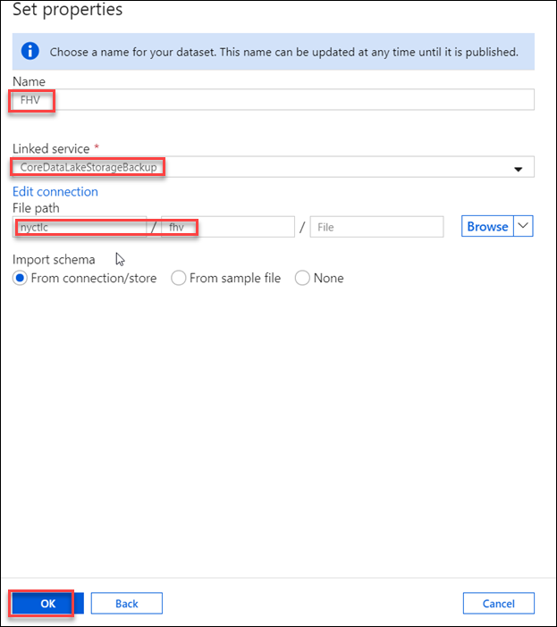

## Exercise 3: Create Schemas, Tables, Stored Procedures and Datasets for SQL Pool.

### Task 1: Create Schemas in SQL Pool.

1. Create **Staging** schema

    - Navigate to **Data**-> Databases ->**SQL Pool**->**Schemas**->**New SQL Script**->**New Schema**
    - **Run** the command **CREATE SCHEMA [Staging]**.
  
    
  
2. Create **Backup** Schema

    - Navigate to **Data**-> Databases ->**SQL Pool**->**Schemas**->**New SQL Script**->**New Schema**
    - **Run** the command **CREATE SCHEMA [Backup]**.
    - **Publish** the changes made after creating both the schemas.
   
   
### Task 2: Create Tables in SQL Pool.
 
 1. Navigate to **Develop->SQL scripts**, Select and execute the SQL script **CreateStagingBackupTables SETUP ONLY** that you imported in exercise 2.Make sure you are connected to **sqlpool**
 
 2. Click on **Run**
 
 3. Make sure 5 tables are created.
 
    

 
### Task 3: Create Stored Procedures in SQL Pool.
 
1. Navigate to **Develop->SQL scripts**, Select and execute the SQL script **CreateStoredProcedures SETUP ONLY** that you imported in Exercise 2.Make sure you are connected to **sqlpool**

2. Click on **Run** 

3. Make sure 7 stored procedures are created

   

4. **Publish** after creating both tables and Stored Procedures.

### Task 4: Create Datasets for the pipeline.

1. Navigate to Data->Datasets-> **New Dataset**

   

2. Creation of **FHV Dataset**.

   - Search for **ADLS Data Lake Storage Gen 2** and Click on **Continue**.

   

   - Select **Parquet** as format of data and click continue.

   
 
   - Under Set Properties provide the name as **FHV**
   
   - Select the previously created Linked Service **CoreDataLakeStorageBackup**
   
   - Browse to the File Path nyctlc/fhv
   
   - Click on **OK**,the first dataset is now created.Similarly create the remaining datasets

   

2. Similarly create another 16 datasets by following the below list.
   

3. Make sure 17 datasets are created.Click on **Publish All** then click on **Publish** to commit the changes you have made.
   
   Click **Next** to go to the next exercise.
