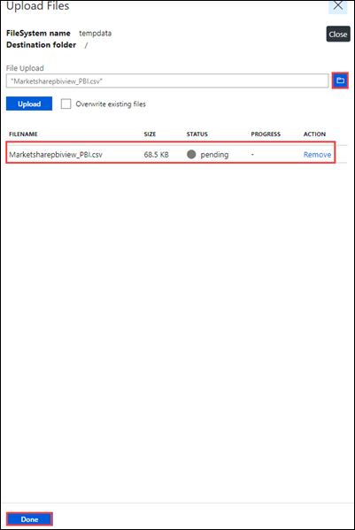
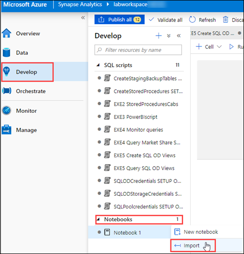
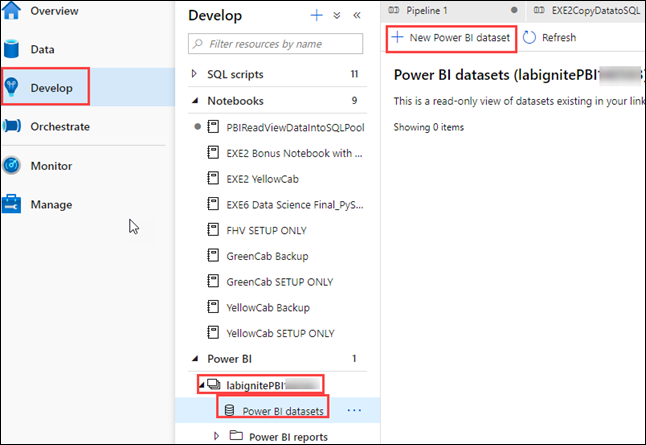
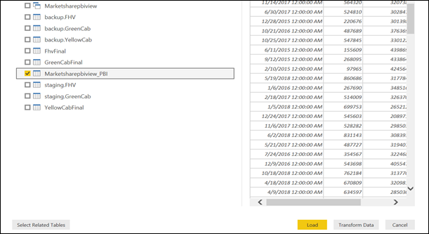
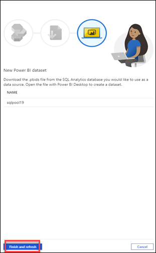

## Exercise 4: Create Pipeline and PowerBI dataset.

### Task 1: Create the pipeline.

1. Create Pipeline **EXE2CopyDatatoSQL** by clicking on **Orchestrate**, then + Icon and click on Pipeline.

   
  
2. Name the Pipeline **Exe2CopyDatatoSQL**

   
   
3. Browse to C:\LabFiles\Building-an-end-to-end-analytics-pipeline-in-Microsoft-Azure-master\labfiles\EXE2CopyDatatoSQL.json
   Copy the code as you will be using it in the next step.
   
4. Now click on **Code** on the right corner of the page and paste the code from **EXE2CopyDatatoSQL.json** and click on **OK**. 
   and then click on **Validate** to check if there any errors.

   
   
### Task 2: Curate the  Yellow, Green Cab and FHV

1. Navigate to **Develop**->**Notebooks**

2. FHV SETUP ONLY,YellowCab SETUP ONLY and GreenCab SETUP ONLY are the notebooks which you imported in Exercise 2.

3. Follow the instructions(Replace the Stoarge account name) in the notebook and Click on **Run** to execute the Notebook **FHV SETUP ONLY**

4.  Follow the instructions and Run the Notebook **YellowCab SETUP ONLY**

5.  Follow the instructions and Run the Notebook **GreenCab SETUP ONLY**

### Task 3: Create the PowerBI dataset.

1. Upload **Marketsharepbiview_PBI.csv** into the **Tempdata** folder by clicking on **Data** on the Left Pane, then Select tempdata      container and then click on **Upload**.

   

2. Browse for **Marketsharepbiview_PBI.csv** 
  - Navigate to C:\LabFiles\Building-an-end-to-end-analytics-pipeline-in-Microsoft-Azure master\labfiles\Marketsharepbiview_PBI.csv     and Select   Marketsharepbiview_PBI.csvthen click on **Done**.

   

3. Click on **Develop** on the left Pane and then import the Notebook **PBIReadViewDataIntoSQLPool**

   

4. Click on **Configure session** on the Right side of the page.

   

5. Configure the session as follows:

   

6. Open the notebook **PBIReadViewDataIntoSQLPool** and Update the ADLS storage account name in Cell 1 and Cell 3 and Click on **Run All**.

   

7. Navigate to **Develop** on the left pane and click on **Power BI datasets** under the **Power BI Linked service**. Then Click on **+ New Power BI dataset.**

   

8. Click on **Start** on the page that comes up.

   

9. Click on **sqlpool** and then click on Continue.

   

10. Now click on **Download**

    

11. Open the downloaded file in the Power BI desktop and Log into the Power BI Desktop using Microsoft Account and **sign-in**. Then click on **Connect**

    

12. Click on **Marketsharepbiview_PBI** (previously created in the step1) and then click on **Load Data**.  

    

13. Publish your Desktop PBI to the Power BI workspace that you linked to your Synapse workspace.

    

14. Make sure you publish on the PBI Workspace created by you.Click on **Select**.

    

15. Go back to the Synapse Workspace and then click on Finish and refresh

    
    
    Click **Next** to go to the next exercise.

   
