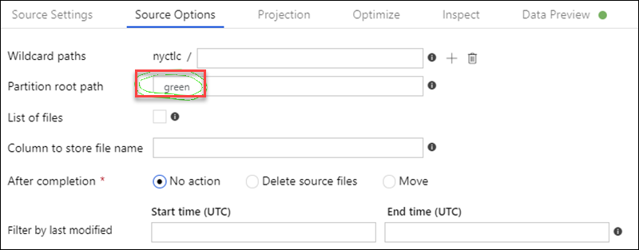
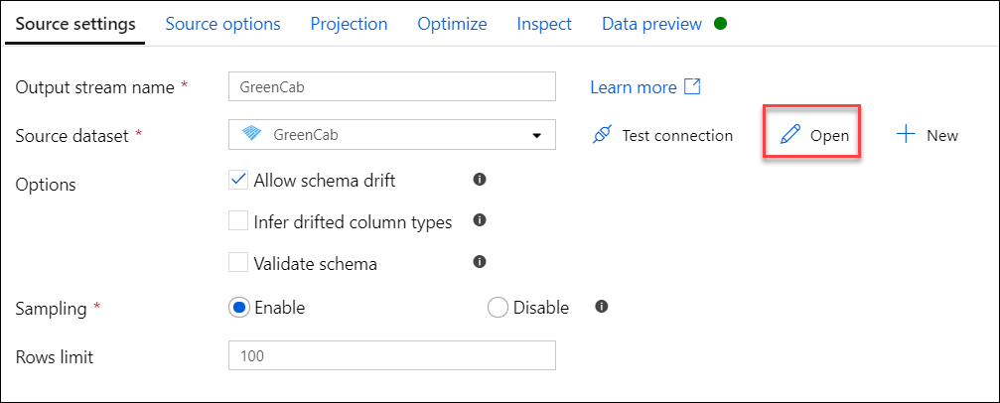
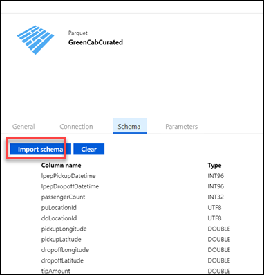
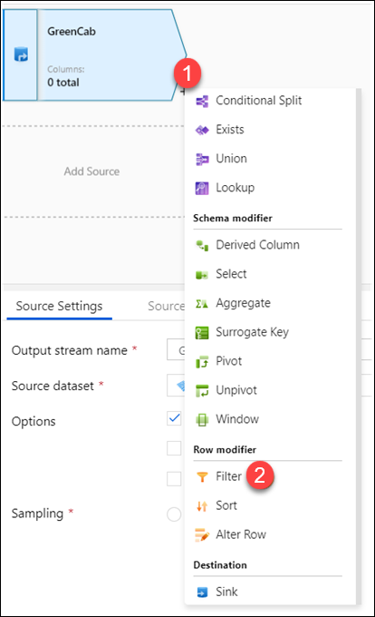
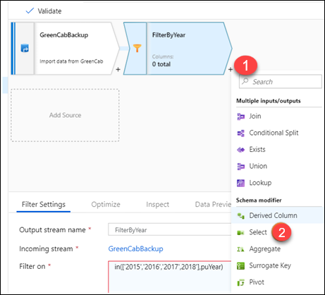
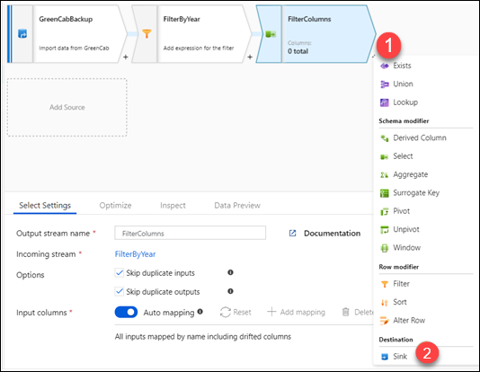
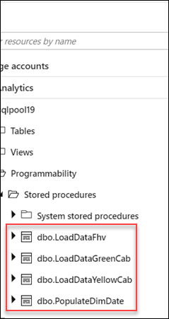
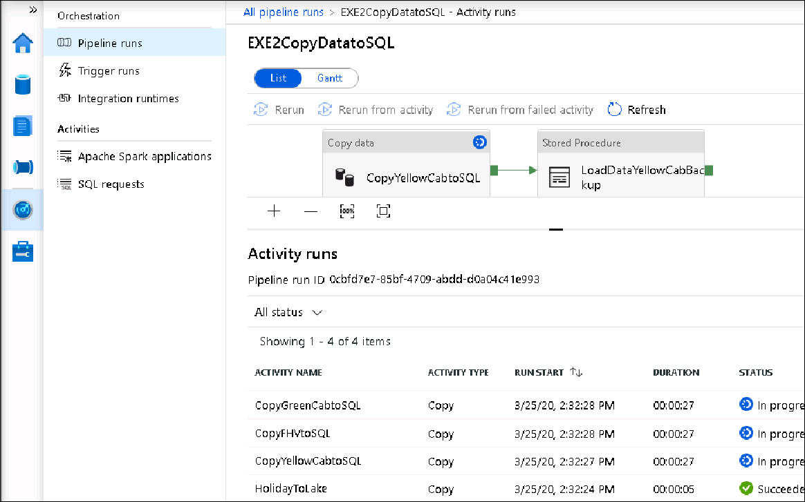
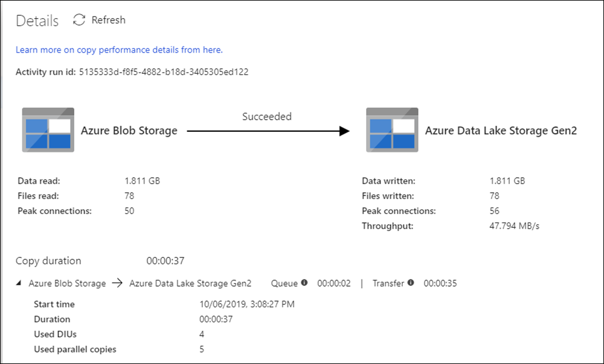
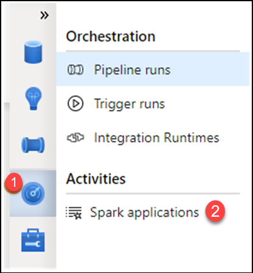

## Exercise 6: Build Modern Data Warehouse pipelines

This section is very important to create a pipeline with parallel activities to bring data into the lake,transform it and load it into the SQL Pool.

### Task 1: Create and run a Notebook for YellowCab

- In this notebook you will see the power of the AAD passthrough between compute and storage whether it’s a data lake or a database. You will see how simple it is to write into a SQL Pool table with Spark thanks to the connector. No need to create password, identity, external table, format sources. It’s all managed by the connector!

1. Go into the **Develop->Notebooks** section

2. Select the notebook **EXE2 YellowCab**. **Replace the storage account name** in the cell 1 .

3. And replace the **sqlpoolname to sqlpool** and **storage account name** in cell 5.

3. Configure and author your notebook:
   - Attach your **Spark Pool**
   - Select **Spark(Scala)** as a language
   - Define the configuration of the session. Defining the configuration of a session enables you to increase the resources of running a notebook. Use **4 executors** of medium size for that notebook. You want to run it fast!

   
   
4. Click on **Run All**

   

5. Click on **Publish**

   

### Task 2: Create and run a Dataflow with GreenCab dataset

- In this task, we will be doing a similar as in task 1 but in a code-free environment on the green cab data. You will also learn the important concept of dataset by creating a new dataset.

1. Navigate to **Develop** then **+** Icon->Data flow

2. In Data Flow, create a **New data flow**

3. Name the Data Flow activity **GreenCabTransformation**

   

4. Turn on **Data Flow Debug**, select **AutoResolveIntegrationRuntime** and click **Ok**

5. Click on **Add Source**

   

6. Select the source dataset as **GreenCab**

7. Give the output stream name as **GreenCab**

8. Select **Enable** sampling

   

9. In the Source Options:

  - Partition root path: **green**

    

10. On Source Settings Click on **Open** to edit the **GreenCab** Dataset 

    

11. **Import schema** From connection/store

    

12. Click on + next to the GreenCab activity

    

13. Select the filter from row modifier 

14. Enter the following for **Output stream name: FilterByYear**

15. Click on **Filter on**

    

16. Write the following in the box: in(['2015', '2016', '2017', '2018'],puYear)

    

17. Click on **Save and Finish**

18. Click on + next to the Filter activity

19. Select the **Select** Activity

    

20. Enter the following for **Output stream name: FilterColumns**

21. Select the **incoming stream name: FilterByYear**

22. **Select Automapping**

    

23. Remove the columns if required: vendorID, lpepPickupDateTime, lpepDropoffDateTime, tripDistance,rateCodeId, storeAndFwdFlag, paymentType, fareAmount, extra, mtaTax,improvementSurcharge, tollsAmount, ehailFee, tripType.

    

24. Click on + next to the Filter activity

25. Select the **Sink** destination

    

26. Call the output stream name **GreenCabSink**

27. Select **+New** as dataset, Select **Azure Datalake Storage Gen2** as a storage layer

28. Select **Parquet** 

29. Name it as **DataflowSink**

30. Select the linked service **CoreDataLakeStorageBackup**

31. For the File system in the file path, write **tempdata**

32. Click on **Finish**

33. If you preview the data of GreenCabSink, you should see the following:

    

34. Turn off the **Debug Session** and click on **Publish all**

    

35. Try to run the data flow in a pipeline by following the flow below (you will monitor that pipeline later on in task 5)

 - Click on **Orchestrate**

 - Add a new pipeline by clicking **+**

 - Drag and drop a data flow activity in the pipeline. Make sure that you select **GreenCabTransformation**.

 - **Publish** the pipeline

 - Click on Add and trigger and select **Trigger Now** (Do not wait for the result to finish (it will take 7 minutes – you will see the result in task 5))

   

### Task 3: Create Stored Procedures

- In this section, we will create stored procedures in the SQL Pool that will be triggered in the pipeline once
the curated data is loaded in the SQL Pool.

1. Open the SQL script in the **Develop section** called **EXE 2 StoredProceduresCabs**. This script will create four stored procedures that you will later integrate in your pipeline once the loadoperation in the SQL Pool happens.
 
2. Click on **Run** and it will run the entire SQL script

   

3. Check that you can see the four stored procedures by browsing your SQL Pool:

   

### Task 4: Understand a pipeline that contains all activities

-  This pipeline **EXE2CopyDatatoSQL** copies the curated data from the lake into a SQL Pool as staging table. A staging table is a table optimized for loading/writing data. Once the copy activity is complete, it triggers a stored procedure that transforms the staging table into a destination table whose goal is to provide strong read performance. 

1. Click into the **Orchestrate** section

2. Select the pipeline **EXE2CopyDatatoSQL** in the Pipelines

3. **Publish the Pipeline** and then Select **Add trigger** then followed by **Trigger now**

4. Check the various activity runs in the pipeline

   

### Task 5: Monitor the pipelines

- Synapse will offer a single pane of glass to monitor activities. We will first look at the pipelines that you have triggered.

1. Click at the section **Monitoring**

2. Click into **Pipeline runs**, make sure that the time of filtering is set to Last 30 days

   

3. Check the status of your pipeline **EXE2CopyDatatoSQL**. It should be in-progress where as the other pipeline **GreenCabTransformation** that you triggered in task 2 would be succeeded by now.

4. To understand at a more granular level, the status of the activities in the pipeline, click on the pipeline

   

   

   
   
   

5. You can get the detail of an activity by clicking to the binocular icon only if the status is already is already succeeded. In this case, you can see the performance of a copy command activity. Check the various details based on the different activities you ran. (Data Flow, notebook, SQL Script)

   

### Task 6: Monitor Spark applications

- A Spark application consists of many activities that have run into a single session. A session is displayed as in-progress, failed or cancelled. When a user is done with her job, the application session ends as cancelled. It is by no mean a negative impact.

1. Click at the section **Monitoring**

2. Click into Spark Applications

   

3. You can see the application name (and click into it for more details), see who submitted this job,
the time, the stats, which pool template was leveraged and the job type.

   

4. Click into one application and check the picture below highlighting some of the monitoring functionalities

   
   
   Click **Next** to go to the next exercise.
